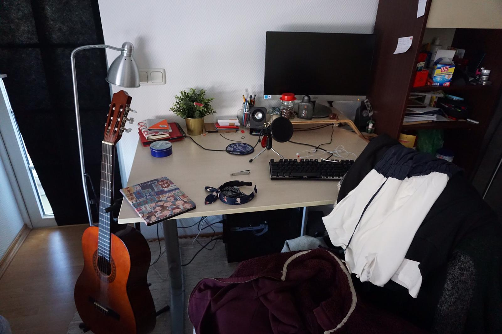

## Raspberry Pi Projects
A detailed write up will be provided once a project is done.

### Done
Sadly none :/

### In progress
* Saving money to buy a Raspberry Pi 3b+

### Planned
* Set up a NAS server which can be remotely accessed via OpenVPN.
* Set up an Apache server to learn basics of web development.
* Set up a shared calender for the internal network.

[comment]: <> ()
